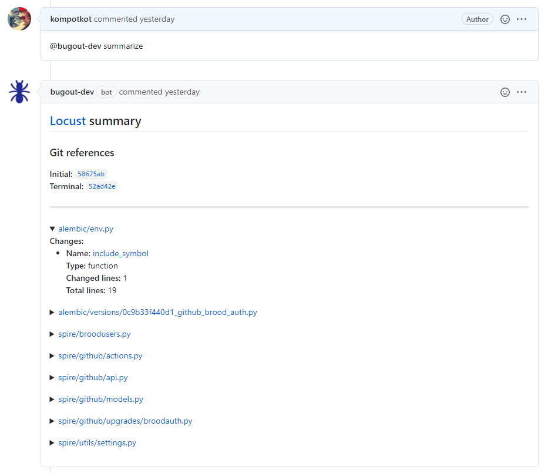
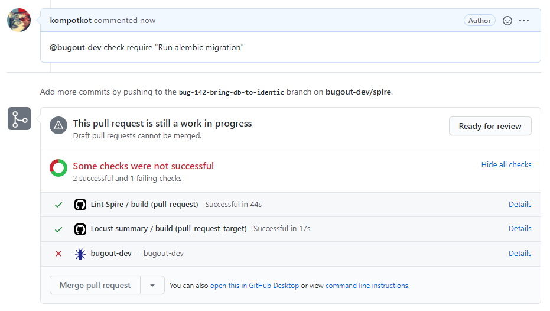
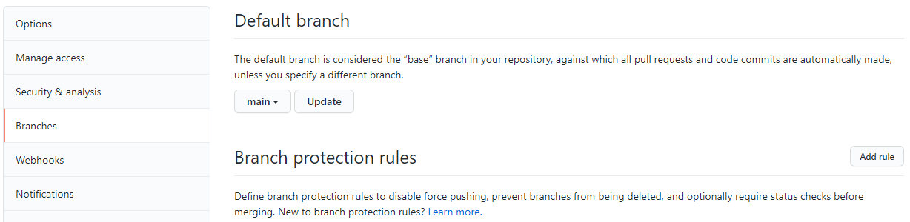
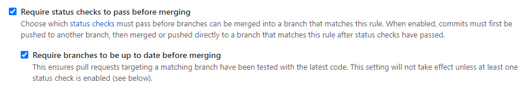
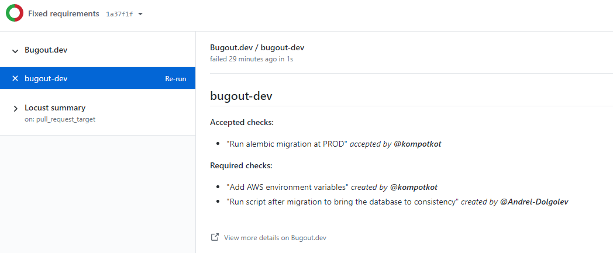
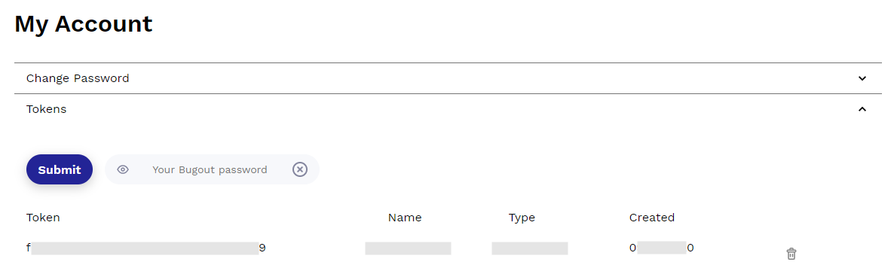
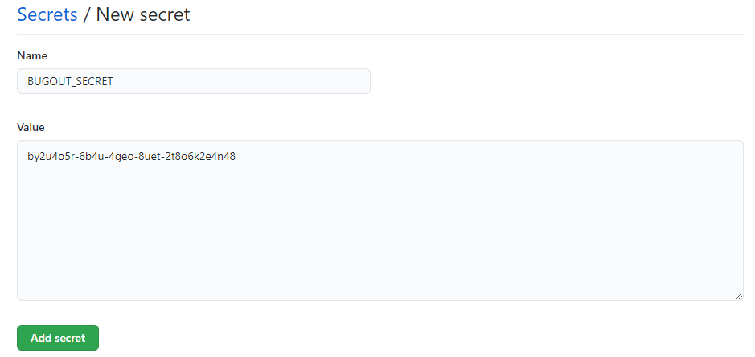

# github-demo

Demos for Bugout GitHub integration.


## Bugout at GitHub

Bugout is a knowledge management system for software teams. 

Our continious integration tools represented by:

[**Locust summary**](https://github.com/bugout-dev/locust) - run static analysis in CI/CD environments and post summaries to pull requests. 

Users can also use a JSON representation of this metadata in their CI/CD environments to program checks like: "Every time we add a function, we should add a test in the corresponding testing module."




**CI Checks** - a checklist of external actions that must be taken before a change can be deployed. This checklist can include things like running database migrations, setting environment variables, or modifying a load balancer.




### Advantages and Key Features

For workflows, with a heavier downside for errors, human oversight is important. Consider a service which:
- Help developer to emits metadata describing AST-level changes to your code base between git revisions
- Provide users with a checklist of manual actions to complete
- Allow users to check off items from that list one by one
- Refuse to progress to completion until all manual actions were complete

## Build you Bugout environment!

At first we setup check list CI tool and then we will add Locust code analyzer.

### Install Bugout GitHub Bot

- Visit [Bugout GitHub Bot](https://github.com/apps/bugout-dev)
- Install it to Organization or Private repositories

### Setup repository branch rules

- Go to settings of current repository
- Chose `Branches` and `Add rule` in section `Branch protection rules`



- Add rule `Require status checks to pass before merging`



**At this step you are be able to work with Bugout Checks**

### Work with Bugout Checks!

- To add new check, add comment to Pull Request:
```
@bugout-dev check require <your crucial check>
```
- To acept check:
```
@bugout-dev check accept <your crucial check>
```
- You can watch statuses of `reuired` and `accepted` checks at `Details` at our [example](https://github.com/bugout-dev/github-demo/pull/2) PR

> **Note:** You can put your phrase in qutes or without it



To be able to add Locust reports and run static analysis of code you need prepare Bugout accout and prepare repository.

### Register at Bugout and generate token

- Visit [Bugout](https://bugout.dev) website and create account
- Generate new token at [Bugout Tokens](https://alpha.bugout.dev/account)



### Add token to GitHub Secrets

- Add generated token to Organization `Secrets` and call it as `BUGOUT_SECRET`



### Prepare Locust

- Add file `locust.yaml` in `.github/workflow/` repository. Example of file lives [here](https://github.com/bugout-dev/github-demo/blob/main/.github/workflows/locust.yaml)
- Be sure this file exists in `main` branch and your new Pull Requests branch out with it

Core of file upload whole commit history with `actions/checkout@v2`
```yaml
name: Locust summary

on: [ pull_request_target ]

jobs:
  build:
    runs-on: ubuntu-20.04
    steps:
      - name: PR head repo
        id: head_repo_name
        run: |
          HEAD_REPO_NAME=$(jq -r '.pull_request.head.repo.full_name' "$GITHUB_EVENT_PATH")
          echo "PR head repo: $HEAD_REPO_NAME"
          echo "::set-output name=repo::$HEAD_REPO_NAME"
      - name: Checkout git repo
        uses: actions/checkout@v2
        with:
          repository: ${{ steps.head_repo_name.outputs.repo }}
          fetch-depth: 0
```

Install python with `actions/setup-python@v2` and `bugout-locust` from PyPI

```yaml
      - name: Install python
        uses: actions/setup-python@v2
        with:
          python-version: '3.8'
      - name: Install dependencies
        run: |
          python -m pip install --upgrade pip setuptools
          pip install bugout-locust
```

At path according to environment variable `$GITHUB_EVENT_PATH` leaves GitHub Action JSON file with detailed information about current commit, repository and branch

```yaml
      - name: Generate Locust summary
        run: |
          COMMENTS_URL=$(python -c 'import json; import os; event = os.environ.get("GITHUB_EVENT_PATH"); raw = open(event); inp_json = json.load(raw); print(inp_json.get("pull_request").get("_links").get("comments").get("href")); raw.close();')
          INITIAL_REF=$(locust.github initial)
          TERMINAL_REF=$(locust.github terminal)
          REPO_URL=$(locust.github repo)
          locust --format json $INITIAL_REF $TERMINAL_REF --github $REPO_URL --metadata "{\"comments_url\": \"${COMMENTS_URL}\", \"terminal_hash\": \"$TERMINAL_REF\"}" | tee summary
      - name: Cleaning summary
        id: clean_summary
        run: |
          summary=$(cat summary)
          summary="${summary//'%'/'%25'}"
          summary="${summary//$'\n'/'%0A'}"
          summary="${summary//$'\r'/'%0D'}"
          echo "::set-output name=summary::$summary"
```

To be able to run static analysis and respond back with comment to Pull Request we store code metadata

```yaml
      - name: Upload locust results to Bugout
        env:
          BUGOUT_SECRET: ${{ secrets.BUGOUT_SECRET }}
        run: |
          curl -k -X POST "https://spire.bugout.dev/github/summary" \
            -H "Content-Type: application/json" \
            -H "Authorization: Bearer $BUGOUT_SECRET" \
            --data '${{ steps.clean_summary.outputs.summary }}'
```

### Generate your first Locust summary!

- Create new Pull Request, please see our [example PR](https://github.com/bugout-dev/github-demo/pull/2)
- Wait a bit until GitHub Action `Locust` completes
- And just type a comment:
```
@bugout-dev summarize
```

## Resources & Links

Bugout web site
- https://bugout.dev

Bugout GitHub Bot
- https://github.com/apps/bugout-dev

Bugout Locust package
- https://github.com/bugout-dev/locust

Locust `.yaml` file
- https://github.com/bugout-dev/github-demo/blob/main/.github/workflows/locust.yaml
